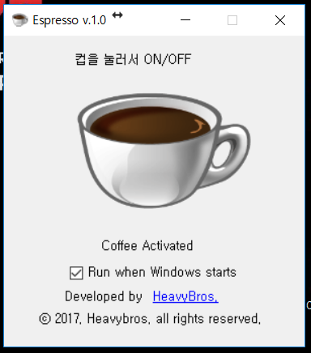
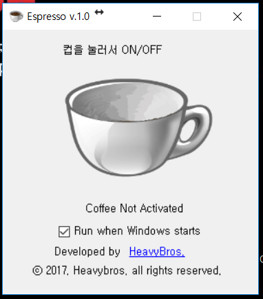
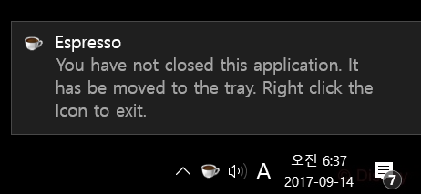
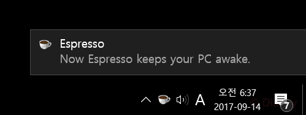
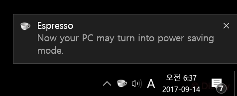

# Espresso
**[Caffeine](http://lightheadsw.com/caffeine/) for Windows. Keep your Windows awake.**


## Purpose
[Caffeine](http://lightheadsw.com/caffeine/) was the most well-known app to keep your mac awake. For Windows users, **Espresso** could be an alternative.

## Run
- 
Click the cup to activate Espresso. If the cup is full with coffee, your Windows keeps awake.
- 
Click the cup to deactivate Espresso. If the cup is empty, your Windows may turn into power saving mode.
- 
Espresso keeps running until exit on the system tray.
- 
Clicking the system tray icon also works.
- 
Espresso shows a system tray message when it was activated/deactivated.

## Licence
```
MIT License

Copyright (c) 2019 Haenala Shin

Permission is hereby granted, free of charge, to any person obtaining a copy
of this software and associated documentation files (the "Software"), to deal
in the Software without restriction, including without limitation the rights
to use, copy, modify, merge, publish, distribute, sublicense, and/or sell
copies of the Software, and to permit persons to whom the Software is
furnished to do so, subject to the following conditions:

The above copyright notice and this permission notice shall be included in all
copies or substantial portions of the Software.

THE SOFTWARE IS PROVIDED "AS IS", WITHOUT WARRANTY OF ANY KIND, EXPRESS OR
IMPLIED, INCLUDING BUT NOT LIMITED TO THE WARRANTIES OF MERCHANTABILITY,
FITNESS FOR A PARTICULAR PURPOSE AND NONINFRINGEMENT. IN NO EVENT SHALL THE
AUTHORS OR COPYRIGHT HOLDERS BE LIABLE FOR ANY CLAIM, DAMAGES OR OTHER
LIABILITY, WHETHER IN AN ACTION OF CONTRACT, TORT OR OTHERWISE, ARISING FROM,
OUT OF OR IN CONNECTION WITH THE SOFTWARE OR THE USE OR OTHER DEALINGS IN THE
SOFTWARE.
```
